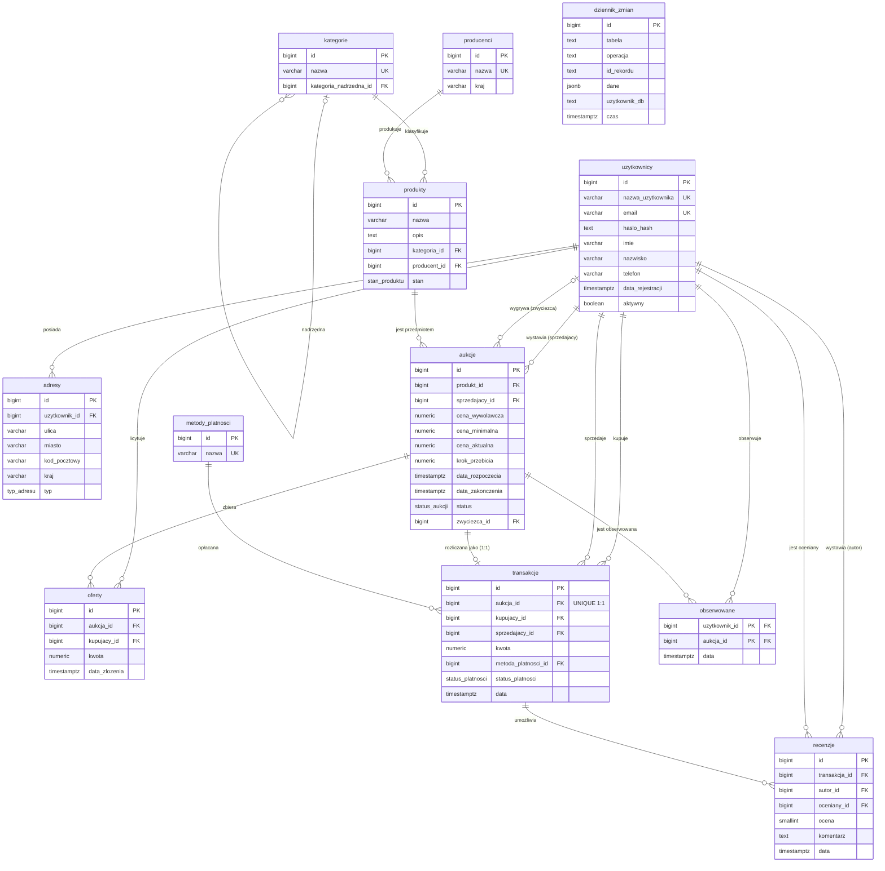

# Diagram ERD — platforma aukcyjna

Diagram związków encji (ERD) w notacji Mermaid (`erDiagram`). Na GitHubie oraz
w edytorach wspierających Mermaid renderuje się automatycznie. Można go też
wkleić do [mermaid.live](https://mermaid.live), aby wyeksportować do PNG/SVG.

## Schemat

## Uwagi do diagramu

- `kategorie` zawiera **samoodwołanie** (`kategoria_nadrzedna_id → kategorie.id`),
  co tworzy hierarchię kategorii i umożliwia rekurencyjne CTE.
- `aukcje` ma **dwa** klucze obce do `uzytkownicy`: `sprzedajacy_id` (wymagany)
  oraz `zwyciezca_id` (opcjonalny, ustawiany przy rozliczeniu).
- `transakcje` ma dwa klucze obce do `uzytkownicy` (`kupujacy_id`,
  `sprzedajacy_id`) oraz relację **1:1** z `aukcje` (`aukcja_id` z więzem
  `UNIQUE`).
- `recenzje` wskazuje dwa konta (`autor_id`, `oceniany_id`) i powiązaną
  `transakcja_id`.
- `dziennik_zmian` to tabela audytowa bez kluczy obcych — przechowuje historię
  operacji w formacie JSONB (wypełniana triggerem `trg_audyt`).
- Oznaczenia liczności: `||` = dokładnie jeden, `o{` = zero lub wiele,
  `o|` = zero lub jeden.
